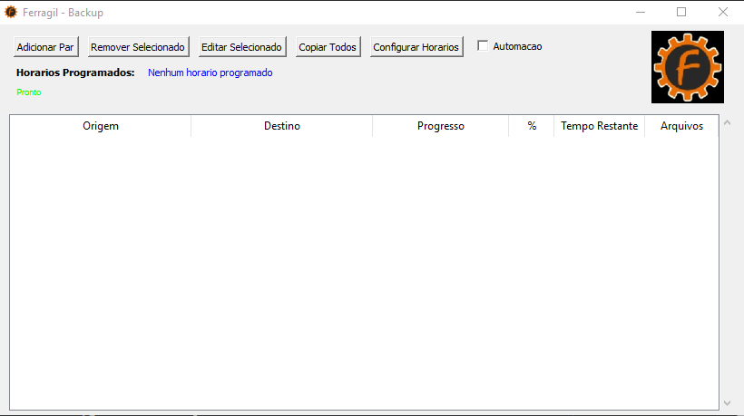

# FerragilBackup

This is a python software created to automatically (or manually) backup specified directories with user friendly GUI and with some copy/paste verification.

# Features
- It will only copy files from origin directory that have been edited or new files.
- The automation checkbox (copy/paste) task runs every time the .exe is launched, at Windows startup, and you can create custom schedules.
- low overhead (60s time update)

# Support
For Windows XP, Windows 7, Windows 8 (and 8.1), Windows 10, Windows 11

